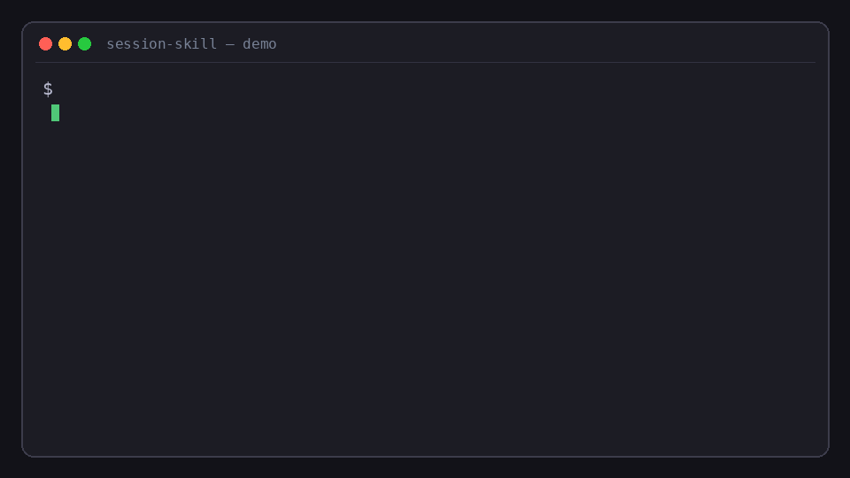

# session-skill

**Record a successful agent session (chat + tool traces) → emit an installable Agent Skill (`SKILL.md` + `references/`) for Cursor and Claude Code.**

Local path install only. No marketplace, no cloud, no lint companion.

## Problem

You already solved a task once with an agent. Replaying that workflow later means re-prompting from scratch. Session exports contain the procedure, but they are not packaged as a reusable skill.

## One-liner

`session.json` -> `SKILL.md` + `references/` + `INSTALL.md` (heuristic distill, no LLM API, no network).

*Demo: convert a sample session → installable `SKILL.md` + `references/`.*

## Quick start

Run the offline demo (see package.json scripts.demo):

    npm run demo

Or convert any session file:

    node bin/session-skill.js convert fixtures/sample-session.json --out ./skills/add-retry-to-fetch
    node bin/session-skill.js convert path/to/session.json --out ./skills/my-skill --name my-skill

Requires Node.js >= 18. Zero runtime dependencies.

## Install paths

After conversion, copy the output folder:

| Agent | Path |
|---|---|
| Cursor | `.cursor/skills/<name>/` |
| Claude Code | `~/.claude/skills/<name>/` |

See the generated `INSTALL.md` in each skill folder.

## How it works

1. Read a session JSON (title + messages with user / assistant / tool turns).
2. Heuristically extract goal (first user message or title), shell/tool commands, and files touched.
3. Write SKILL.md (YAML frontmatter + markdown procedure), references/session-summary.md, and INSTALL.md.

No cloud calls. No GitHub auth. Pure local conversion.

## Session schema

See the `_schema` field in `fixtures/sample-session.json` for the expected shape.

## Demo

Fixture: `fixtures/sample-session.json` — fictional successful session (*add retry to fetch wrapper*). The package `demo` script converts it to `./skills/add-retry-to-fetch` and prints paths plus a `SKILL.md` preview.

Expected outputs: `SKILL.md`, `INSTALL.md`, `references/session-summary.md`.

## License

MIT © 2026 levi-qiao
